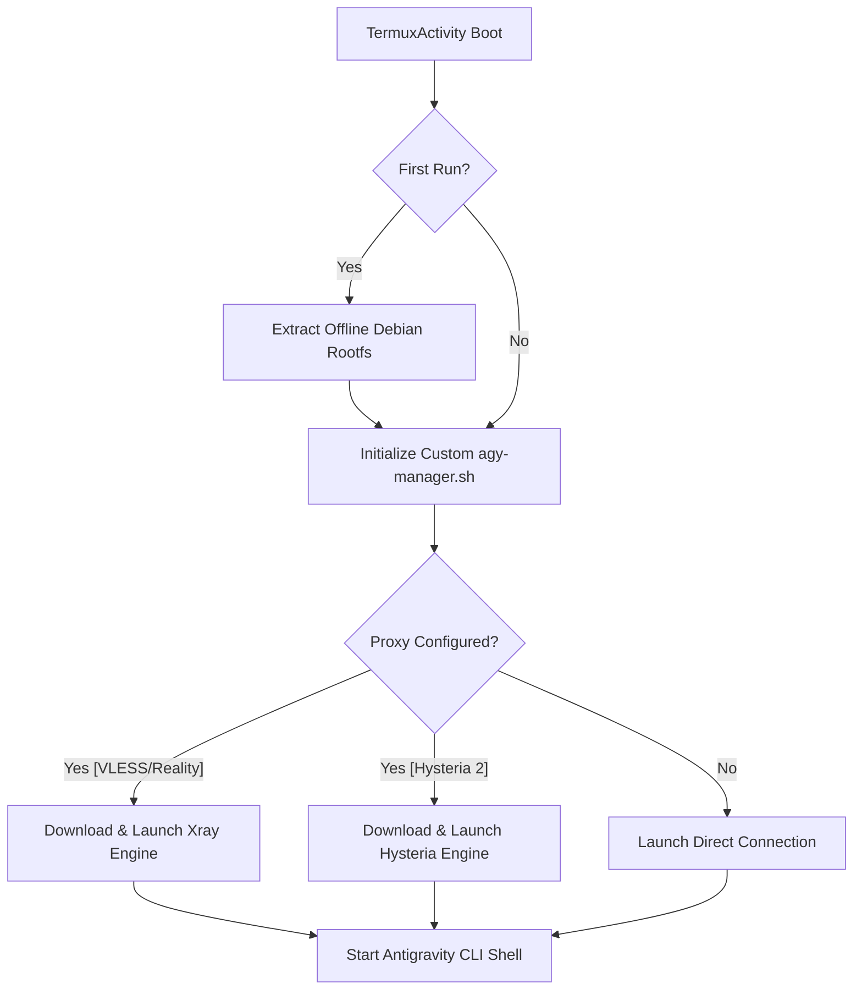

# antigravity-cli-mobile

[](https://www.gnu.org/licenses/gpl-3.0)
[](#)

A customized, premium Android terminal wrapper designed for the automated setup, management, and launch of the **Google Deepmind Antigravity CLI** sandbox environment on mobile devices.

Built on top of the robust **Termux** terminal emulator, this project adds pre-configured automation scripts, offline container provisioning, dynamic proxy engine downloads, and key interface compatibility patches.

---

## 🌟 Key Features

* **⚡ Zero-Configuration Offline Setup**
  * Bundles a pre-compiled Debian Bookworm rootfs container inside application assets.
  * Installs the complete sandbox environment offline on first launch in under 30 seconds without requiring an internet connection.
* **🔒 Double-Bootstrap Protection**
  * Implements synchronized background extraction locks (`mIsInstallingBootstrap`) in Java to prevent duplicate thread crashes during runtime storage permission requests.
* **🌐 Dynamic On-Demand Proxy Engines**
  * Supports high-speed proxies including **Xray (VLESS/Reality)** and **Hysteria 2**.
  * Binaries are *only* downloaded and configured dynamically when the user selects or imports their corresponding configuration, saving bandwidth and keeping first-boot installation instant.
* **⌨️ Universal Keyboard Compatibility**
  * Custom extra-keys toolbar maps arrows to clean, standard ASCII strings (`<-`, `->`, `^`, `v`).
  * Prevents character mapping bugs, replacement glyphs, or localization distortions (e.g., `ij`/`IJ` character bugs) on non-standard device system fonts.
* **🛠️ Automated Self-Heal**
  * Auto-rebuilds and validates active shell configurations, directory symlinks, and background services on start.

---

## 🏗️ Project Architecture



### Core Components
* **[TermuxInstaller.java](app/src/main/java/com/termux/app/TermuxInstaller.java):** Coordinates the offline bootstrap extraction and manages storage permissions using synchronized execution states.
* **[ExtraKeysConstants.java](termux-shared/src/main/java/com/termux/shared/termux/extrakeys/ExtraKeysConstants.java):** Defines layout configurations and ASCII arrow-key fallback mappings for the keyboard toolbar.
* **[agy-manager.sh](app/src/main/assets/agy-manager.sh):** The guest-host supervisor script. Responsible for starting the container, downloading proxy binaries on-demand, generating configurations, and executing the Antigravity shell.
* **[generate_proxy_config.py](app/src/main/assets/generate_proxy_config.py):** Offline URI parser that parses `vless://` and `hysteria2://` configuration links into local configuration files.

---

## 🛠️ How to Build

### Prerequisites
* Java Development Kit (JDK 17)
* Android SDK (API Level 24+)

### Build Steps
1. Clone the repository:
   ```bash
   git clone https://github.com/Milordick/antigravity-cli-mobile.git
   cd antigravity-cli-mobile
   ```
2. Build the universal Release APK:
   ```bash
   export TERMUX_SPLIT_APKS_FOR_RELEASE_BUILDS="0"
   ./gradlew assembleRelease
   ```
3. Locate your compiled APK:
   `app/build/outputs/apk/release/termux-app_apt-android-7-release_universal.apk`

---

## 🎗️ Credits and Attribution

This project is made possible thanks to:
* **[Termux](https://github.com/termux/termux-app):** The outstanding open-source terminal emulator for Android which serves as the core base of this application.
* **Google Deepmind Antigravity Team:** Creators of the Antigravity CLI agent workspace environment.
* **XTLS Team & Apernet:** Developers of the high-performance proxy engines (Xray-core / Hysteria).
