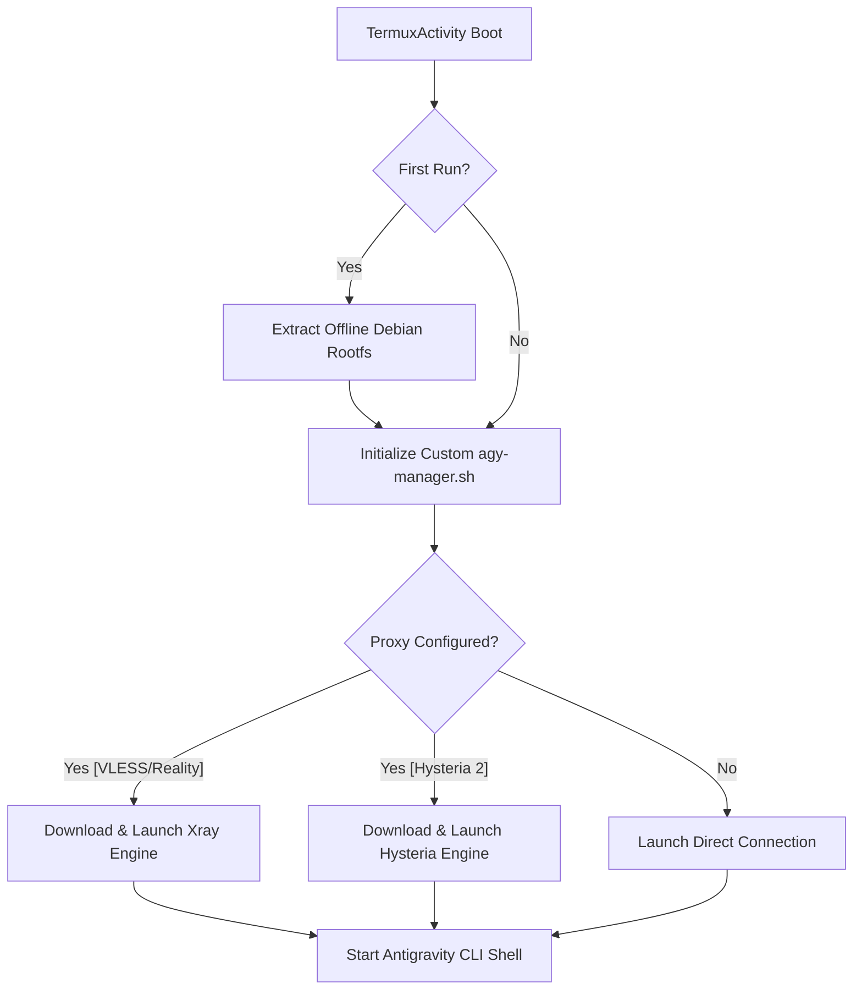
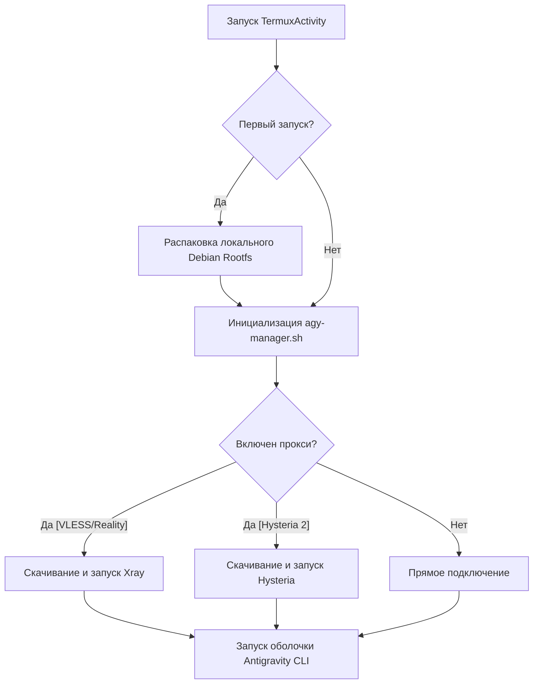

# antigravity-cli-mobile

[](https://www.gnu.org/licenses/gpl-3.0)
[](#)

Customized Android terminal wrapper designed for the automated setup, management, and launch of the **Google Deepmind Antigravity CLI** sandbox environment on mobile devices.

Модифицированный терминальный клиент для Android, предназначенный для автоматической установки, управления и запуска изолированного окружения **Google Deepmind Antigravity CLI** на мобильных устройствах.

---

## 🌍 Language / Язык
* [English Version](#-english-version)
* [Русская версия](#-русская-версия)

---

## 🇺🇸 English Version

This project is built on top of the robust **Termux** terminal emulator, adding offline container provisioning, automated bootstrap procedures, dynamic proxy engine configuration, and key compatibility patches to deliver a premium user experience for Antigravity workspace users.

### 🌟 Key Features

* **⚡ Zero-Configuration Offline Setup**
  * Bundles a pre-compiled Debian Bookworm rootfs container inside application assets.
  * Installs the complete sandbox environment offline on first launch in under 30 seconds without requiring an internet connection.
* **🔒 Double-Bootstrap Protection**
  * Implements synchronized background extraction locks (`mIsInstallingBootstrap`) in Java to prevent duplicate thread crashes during runtime storage permission requests.
* **🌐 Dynamic On-Demand Proxy Engines**
  * Supports high-speed proxies including **Xray (VLESS/Reality)** and **Hysteria 2**.
  * Binaries are *only* downloaded and configured dynamically when the user selects or imports their corresponding configuration, saving bandwidth and keeping first-boot installation instant.
* **⌨️ Universal Keyboard Compatibility**
  * Custom extra-keys toolbar maps arrows to clean, standard ASCII strings (`<-`, `->`, `^`, `v`).
  * Prevents character mapping bugs, replacement glyphs, or localization distortions (e.g., `ij`/`IJ` character bugs) on non-standard device system fonts.
* **🛠️ Automated Self-Heal**
  * Auto-rebuilds and validates active shell configurations, directory symlinks, and background services on start.

### 🏗️ Project Architecture



### 🛠️ How to Build
1. Clone the repository:
   ```bash
   git clone https://github.com/Milordick/antigravity-cli-mobile.git
   cd antigravity-cli-mobile
   ```
2. Build the universal Release APK:
   ```bash
   export TERMUX_SPLIT_APKS_FOR_RELEASE_BUILDS="0"
   ./gradlew assembleRelease
   ```
3. Locate your compiled APK:
   `app/build/outputs/apk/release/termux-app_apt-android-7-release_universal.apk`

---

## 🇷🇺 Русская Версия

Этот проект построен на базе терминального эмулятора **Termux**. Он добавляет автономную установку контейнера, автоматизированные сценарии развертывания, динамическую конфигурацию прокси-серверов и патчи совместимости интерфейса.

### 🌟 Основные Возможности

* **⚡ Установка без Интернета (Offline Bootstrap)**
  * Debian Bookworm упакован непосредственно в ресурсы приложения.
  * Установка окружения при первом запуске занимает менее 30 секунд и не требует подключения к сети.
* **🔒 Защита от конфликтов при первом запуске**
  * Синхронизированные потоковые блокировки (`mIsInstallingBootstrap`) в Java предотвращают сбои и дублирование установки при запросе системных разрешений на доступ к памяти.
* **🌐 Динамическая загрузка ядер прокси**
  * Поддержка высокоскоростных протоколов **Xray (VLESS/Reality)** и **Hysteria 2**.
  * Файлы ядер скачиваются *только тогда*, когда пользователь действительно активирует соответствующий тип подключения, что сохраняет установку мгновенной.
* **⌨️ Исправление стрелочек на клавиатуре**
  * Клавиши навигации переведены на стандартные ASCII-символы (`<-`, `->`, `^`, `v`).
  * Полностью решена проблема искажения шрифтов (когда вместо стрелок отображались буквы `ij`, `IJ` или `Ы`).
* **🛠️ Автоматическое восстановление**
  * Скрипт проверяет и исправляет пути, символические ссылки и состояние фоновых служб при каждом запуске.

### 🏗️ Архитектура



### 🛠️ Инструкция по Сборке
1. Склонируйте репозиторий:
   ```bash
   git clone https://github.com/Milordick/antigravity-cli-mobile.git
   cd antigravity-cli-mobile
   ```
2. Соберите универсальный Release APK:
   ```bash
   export TERMUX_SPLIT_APKS_FOR_RELEASE_BUILDS="0"
   ./gradlew assembleRelease
   ```
3. Готовый APK файл будет находиться по пути:
   `app/build/outputs/apk/release/termux-app_apt-android-7-release_universal.apk`

---

## 🎗️ Credits and Attribution / Благодарности

This project is made possible thanks to:
* **[Termux](https://github.com/termux/termux-app):** The outstanding open-source terminal emulator for Android which serves as the core base of this application.
* **Google Deepmind Antigravity Team:** Creators of the Antigravity CLI agent workspace environment.
* **XTLS Team & Apernet:** Developers of the high-performance proxy engines (Xray-core / Hysteria).
